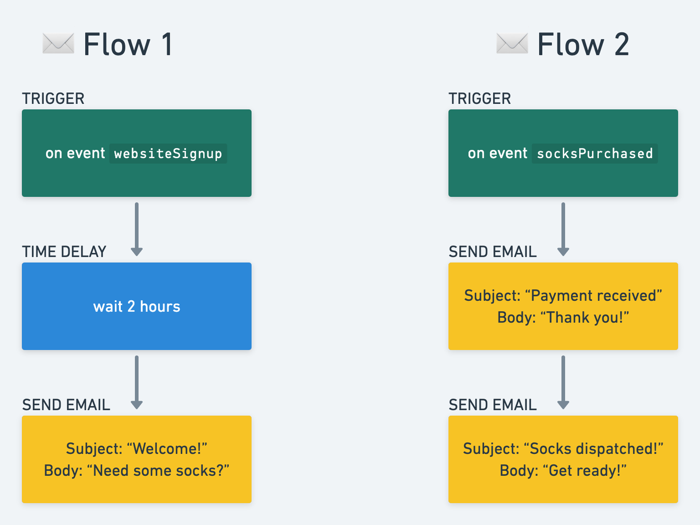

# Pull Your Socks Up 🧦
Let's sell some socks! This tool is here to automate email marketting, drive purchase conversations
and, keep people's feet nice and cosy 🧦

## Getting setup for developers

Clone this repo and then within the project root directory you can run:

### `npm i`

Install dependencies


### `npm run start`

Runs the server.
Open [http://localhost:3000](http://localhost:3000) to view it in the browser.

The page will reload if you make edits.

### `npm run test`

Runs the tests within the `/test` directory.


## How to call the api

With the server running, do a POST request to the `/email` endpoint.

The request body should be in JSON format and contain the following properties:

- `eventName` (string, required): The type of event to trigger the flow. Accepted values are:
  - `websiteSignup`: Indicates a new user has signed up on the website.
  - `sockPurchased`: Indicates a user has purchased a sock.
- `userEmail` (string, required): The email address of the user associated with the event.

For example:
```
{
	"eventName": "sockPurchased",
	"userEmail": "sarah@healthtech1.uk"
}
```
Or...
```
{
	"eventName": "websiteSignup",
	"userEmail": "rainbow@healthtech1.uk"
}
```

`SockPurchased` and `websiteSignup` events should trigger their respective flows shown below 👇

