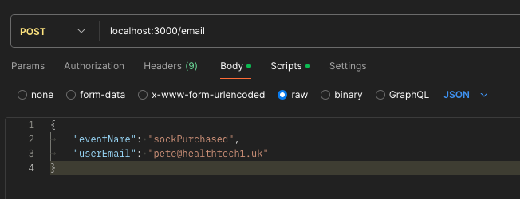

# Pull Your Socks Up 🧦
Let's sell some socks! This tool is here to automate email marketting, drive purchase conversations,
and keep people's feet nice and cosy 🧦

## Getting setup for developers

Clone this repo and then within the root directory you can run:

### `npm i`

Installs dependencies.


### `npm run start`

Runs the server.
Open [http://localhost:3000](http://localhost:3000) to view it in the browser.

The page will reload if you make edits.

### `npm run test`

Runs the tests within the `/test` directory.


## How to call the api

With the dependencies installed `npm i` and server running `npm run start`,
do a POST request to the `/email` endpoint.

>TIP: API requests can be made using the [Postman](https://www.postman.com/downloads/) application



The request body should be in JSON format and contain the following properties:

- `eventName` (string, required): The type of event to trigger the flow. Accepted values are:
  - `websiteSignup`: Indicates a new user has signed up on the website.
  - `sockPurchased`: Indicates a user has purchased a sock.
- `userEmail` (string, required): The email address of the user associated with the event.

For example:
```
{
	"eventName": "sockPurchased",
	"userEmail": "sarah@healthtech1.uk"
}
```
Or...
```
{
	"eventName": "websiteSignup",
	"userEmail": "rainbow@healthtech1.uk"
}
```

`SockPurchased` and `websiteSignup` events should trigger their respective flows shown below 👇


You should observe:
1. 200 response with a message confirming the email process has started and the respective data e.g.
```
{
    "message": "Email processing started",
    "data": {
        "eventName": "sockPurchased",
        "userEmail": "sarah@healthtech1.uk"
    }
}
```
OR if the eventName is invalid, it will return an error.

2. Console log confirming the sock purchase email has been sent (after any delay)
OR an Error will be raised if email fails to send